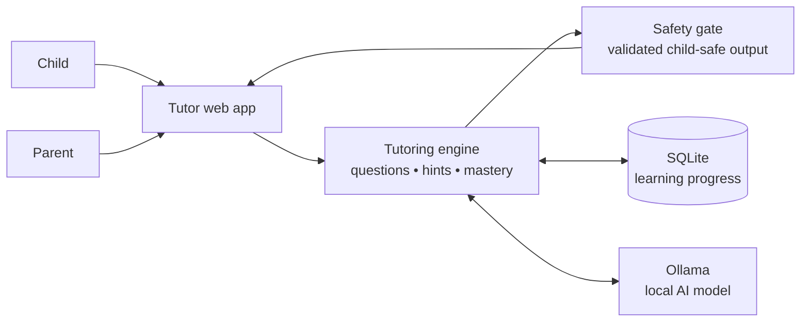
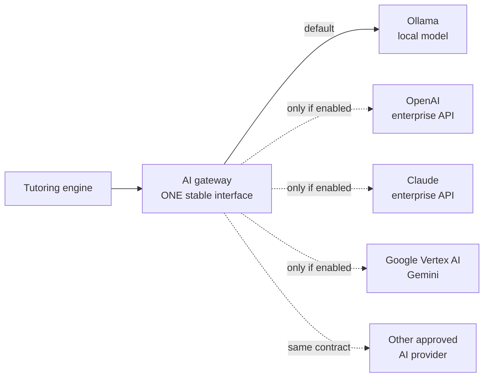
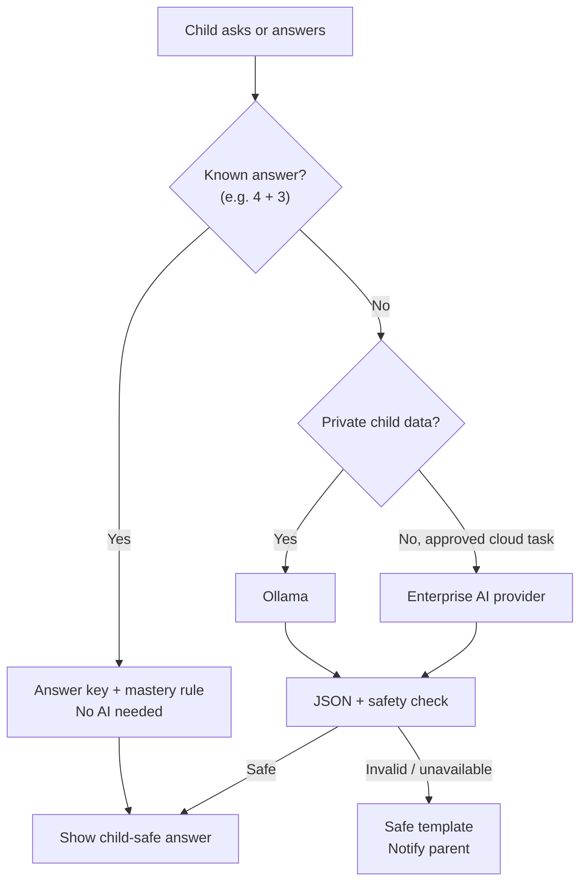
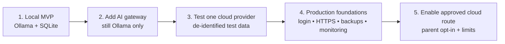

# AI Family Tutor — Diagram-first Architecture

## 1. Start here: local-first MVP



**Everything stays on the family device.**

---

## 2. The plug-in point: one AI gateway



**The tutoring engine does not change when the AI provider changes.**

---

## 3. What happens for every child request



---

## 4. Production version

```mermaid
flowchart TB
  Browser["Parent / child browser"] --> HTTPS["HTTPS + login"]
  HTTPS --> App["Tutor application"]

  subgraph App["Production application"]
    Direction TB
    Tutor["Tutoring + safety engine"]
    Gateway["AI gateway"]
    DB[("Managed database")]
    Logs["Redacted audit logs\ncost • latency • errors"]
    Secrets["Managed secrets"]
    Tutor <--> DB
    Tutor --> Gateway
    Tutor --> Logs
    Gateway --> Logs
    Secrets --> Gateway
  end

  App --> Local["Private Ollama\noptional"]
  App --> Cloud["Approved enterprise AI\noptional"]
```

---

## 5. Safe rollout path


