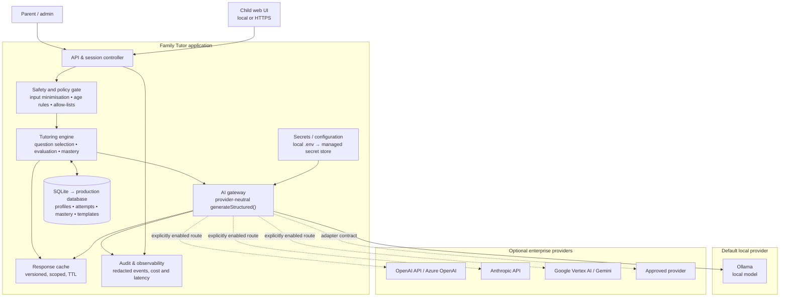
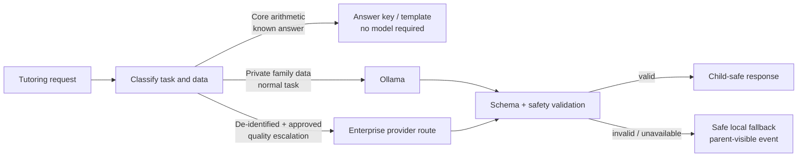
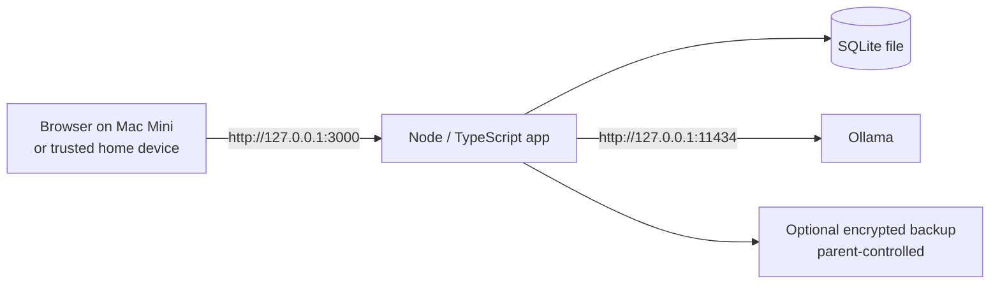
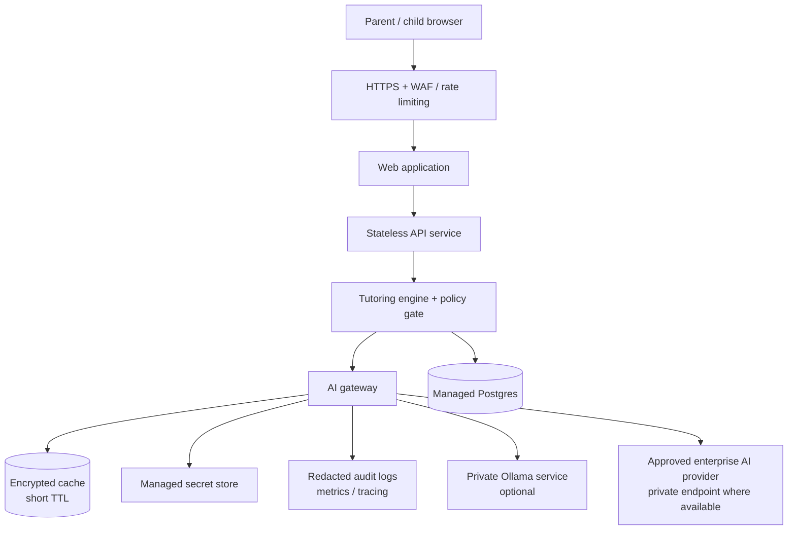

# AI Family Tutor — Architecture Design

## Decision summary

Build one tutoring application with a **provider-neutral AI gateway**. Ollama is the default provider for the private, local-first MVP. Production deployments can enable OpenAI, Anthropic, Google Vertex AI/Gemini, Azure OpenAI, or another approved provider through the same gateway. The tutoring, safety and mastery logic never calls a model provider directly.



## Core boundaries

| Layer | Owns | Must not own |
|---|---|---|
| Web UI and API | Authentication, session transport, parent/child views | Prompt construction or provider API keys |
| Tutoring engine | Curriculum selection, answer-key checks, mastery rules and next-item choice | Provider-specific request formats |
| Safety/policy gate | Input redaction, content allow-lists, schema validation, fallback decisions | Deciding curriculum progression |
| AI gateway | Routing, retries, provider adapters, structured-output normalisation, budget limits | Business rules or persistent child profiles |
| Provider adapter | Translation from neutral request to one vendor SDK/API | Prompt policy or safety bypasses |
| Persistence | Minimal profiles, attempts, mastery, templates, caches and redacted audit events | Raw API keys or raw voice recordings |

## Provider-neutral contract

All providers implement this narrow TypeScript contract. The rest of the application depends only on it.

```ts
type AiTask = 'question-variation' | 'hint' | 'evaluation' | 'parent-summary';

type StructuredRequest<T> = {
  task: AiTask;
  promptVersion: string;
  messages: Array<{ role: 'system' | 'user'; content: string }>;
  schema: object;                 // JSON Schema generated from Zod
  modelClass: 'local-fast' | 'cloud-fast' | 'cloud-reasoning';
  temperature: number;
  maxOutputTokens: number;
  dataClassification: 'family-private' | 'de-identified';
};

type StructuredResponse<T> = {
  data: T;                        // validated against the requested schema
  provider: string;
  model: string;
  requestId?: string;
  latencyMs: number;
  inputTokens?: number;
  outputTokens?: number;
  cached: boolean;
};

interface AiProvider {
  generateStructured<T>(request: StructuredRequest<T>): Promise<StructuredResponse<T>>;
  healthCheck(): Promise<{ available: boolean; detail?: string }>;
}
```

The gateway validates the returned JSON with Zod even when a provider offers native structured output. On failure it retries once with a repair instruction, then returns a safe deterministic template. Raw model text never reaches the child UI.

## Routing policy



Rules:

1. Deterministic answer keys are first choice for factual marking and core arithmetic.
2. Ollama is the default for private child-specific requests.
3. Cloud use is opt-in per environment and only permitted for de-identified payloads unless a parent has explicitly approved a documented exception.
4. The router selects a **model class**, not a vendor/model name. Configuration maps each class to an enabled provider and model.
5. A cloud failure must fall back to Ollama or a safe template; it must never silently send data to a different provider.

## Local-first deployment (MVP)



- Bind both the app and Ollama to loopback by default.
- Keep API keys absent in local-only mode.
- Store the database outside the web root with OS-account file permissions.
- Use local typed input initially; add local speech-to-text only after privacy and quality testing.

## Production deployment (enterprise-capable)



Production changes from the MVP:

- Replace SQLite with managed PostgreSQL and use migrations, backups and point-in-time recovery.
- Run the API as stateless containers or managed services behind HTTPS, WAF and rate limits.
- Use a managed secret store, workload identity and separate development/staging/production projects.
- Use an encrypted, short-lived Redis cache only for approved de-identified outputs. Keep personal learning records in the primary database.
- Add centralised redacted logs, alerts, cost budgets, per-provider circuit breakers and data-retention jobs.
- Keep a private Ollama deployment only when its operational cost and model requirements justify it; otherwise retain it for local/offline mode.

## Enterprise-provider plug-in map

| Provider | Adapter responsibility | Recommended production use | Required controls |
|---|---|---|---|
| Ollama | Local `/api/chat` or `/api/generate`; local model registry | Default private/offline mode; local development | Loopback/private network, pinned model digests, capacity benchmarks |
| OpenAI | Responses/Chat API translation, structured output, usage capture | High-quality de-identified escalation | Project-scoped key, usage limits, approved region/data settings, provider route opt-in |
| Azure OpenAI | Azure endpoint/deployment-name translation | Organisations standardised on Azure identity/networking | Managed identity, private endpoint, Azure policy and separate deployments per environment |
| Anthropic | Messages API translation, structured output/tool conventions | Alternate quality route after evaluation | Scoped key, version-pinned model config, budget/circuit breaker |
| Google Vertex AI / Gemini | Vertex/Gemini request translation and Google authentication | Google Cloud organisations requiring regional governance | Service account/workload identity, project separation, VPC controls where required |
| Other provider | Implement `AiProvider`; pass the shared contract test suite | Only after security, quality and cost evaluation | Contract tests, security review, data-processing approval and explicit router configuration |

Do not expose vendor SDKs outside `server/ai/providers/`. Keep each adapter independently testable with recorded, de-identified fixtures.

## Suggested code layout

```text
server/
  api/                    # HTTP routes and request authentication
  domain/                 # curriculum, mastery, answer-key rules
  safety/                 # redaction, schema validation, child-output policy
  ai/
    gateway.ts            # routing, fallback, budgets, telemetry
    types.ts              # AiProvider and neutral request/response types
    providers/
      ollama.ts
      openai.ts
      anthropic.ts
      vertex-ai.ts
    schemas.ts            # Zod response schemas
  persistence/            # SQLite/Postgres repositories and migrations
  observability/          # redacted events, metrics and tracing
```

## Configuration and secrets

```env
# Route selection. Providers are disabled unless explicitly listed.
AI_LOCAL_PROVIDER=ollama
AI_CLOUD_PROVIDER=
AI_ALLOW_CLOUD=false
AI_CLOUD_ALLOWED_CLASSIFICATION=de-identified

OLLAMA_URL=http://127.0.0.1:11434
OLLAMA_FAST_MODEL=your-pinned-local-model

# Set only in the production secret store, not in source control.
OPENAI_API_KEY=
ANTHROPIC_API_KEY=
GOOGLE_CLOUD_PROJECT=
VERTEX_AI_LOCATION=

AI_MONTHLY_BUDGET_GBP=0
AI_REQUEST_TIMEOUT_MS=15000
```

Production configuration should use provider deployment IDs/model aliases, not hard-coded model names. A model change is a configuration rollout with benchmark, safety and regression-test evidence.

## Security, privacy and reliability controls

- Classify every request before routing. Remove names, dates of birth, school names, free-form identifying text and raw voice/audio before a cloud route.
- Require a parent-controlled cloud opt-in and show the selected provider in the admin area.
- Never use a model as the sole authority for safety, correctness or mastery progression.
- Maintain per-provider rate limits, token/cost ceilings, timeouts, exponential backoff and circuit breakers.
- Record prompt/template version, provider, model, latency, validation result and routing reason—without recording unnecessary child content.
- Use an explicit deletion workflow covering primary data, cache and audit-retention obligations.
- Run contract, safety and curriculum regression tests against every enabled model before promotion.

## Migration path

1. **MVP:** Ollama + SQLite, single device, no cloud credentials.
2. **Hybrid pilot:** introduce `AiProvider`, the gateway and Zod schemas while still routing every request to Ollama.
3. **Controlled cloud evaluation:** add one cloud adapter in a non-production environment with de-identified test fixtures; compare safety, quality, latency and cost.
4. **Production enablement:** implement authentication, managed database/secrets, HTTPS, monitoring, retention and incident runbooks.
5. **Optional cloud route:** enable a single narrowly scoped cloud task only after parent consent, provider approval and automated routing/safety tests.

## Acceptance criteria

- Switching from Ollama to any supported provider requires configuration and an adapter, not changes to mastery, curriculum or safety rules.
- Every provider passes the same structured-output, fallback and redaction test suite.
- No cloud request is made when `AI_ALLOW_CLOUD=false` or the data classification is not allowed.
- A provider outage produces a safe fallback and a redacted audit event.
- Administrators can identify the provider/model used for each decision without seeing unnecessary child data.
